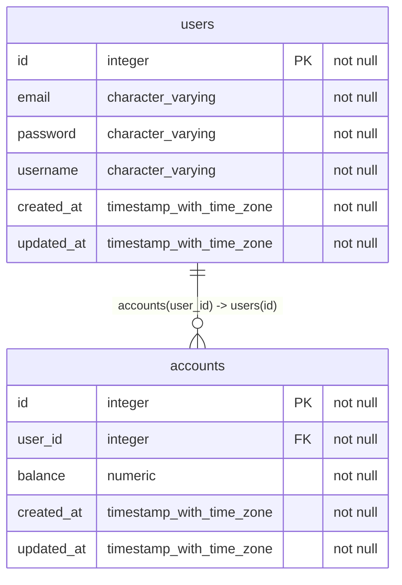

## Diagram

```mermaid
erDiagram

    accounts {
        id integer PK "not null"
        user_id integer FK "not null"
        balance numeric "not null"
        created_at timestamp_with_time_zone "not null"
        updated_at timestamp_with_time_zone "not null"
    }

    users {
        id integer PK "not null"
        email character_varying "not null"
        password character_varying "not null"
        username character_varying "not null"
        created_at timestamp_with_time_zone "not null"
        updated_at timestamp_with_time_zone "not null"
    }

    users ||--o{ accounts : "accounts(user_id) -> users(id)"
```

## Indexes

### `accounts`

- `accounts_pkey`

### `users`

- `unique_email`
- `unique_username`
- `users_pkey`
