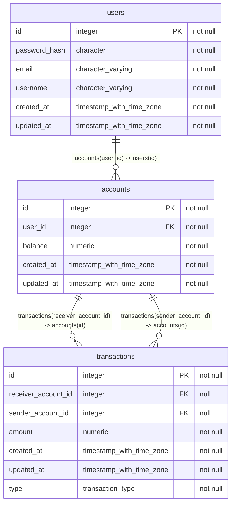

## Diagram

```mermaid
erDiagram

    accounts {
        id integer PK "not null"
        user_id integer FK "not null"
        balance numeric "not null"
        created_at timestamp_with_time_zone "not null"
        updated_at timestamp_with_time_zone "not null"
    }

    transactions {
        id integer PK "not null"
        receiver_account_id integer FK "null"
        sender_account_id integer FK "null"
        amount numeric "not null"
        created_at timestamp_with_time_zone "not null"
        updated_at timestamp_with_time_zone "not null"
        type transaction_type "not null"
    }

    users {
        id integer PK "not null"
        password_hash character "not null"
        email character_varying "not null"
        username character_varying "not null"
        created_at timestamp_with_time_zone "not null"
        updated_at timestamp_with_time_zone "not null"
    }

    accounts ||--o{ transactions : "transactions(receiver_account_id) -> accounts(id)"
    accounts ||--o{ transactions : "transactions(sender_account_id) -> accounts(id)"
    users ||--o{ accounts : "accounts(user_id) -> users(id)"
```

## Indexes

### `accounts`

- `accounts_pkey`

### `transactions`

- `transactions_pkey`

### `users`

- `unique_email`
- `unique_username`
- `users_pkey`
